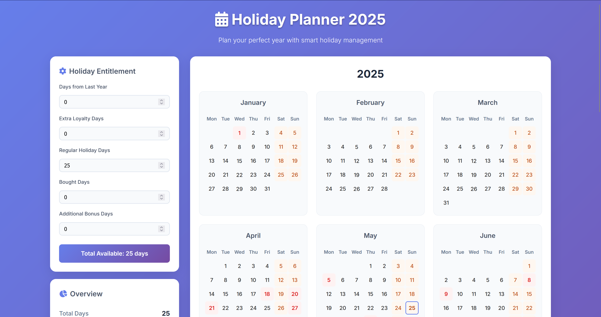

# Holiday Planner 2025 🏖️

A beautiful and intuitive web application to help you plan and manage your holiday days for 2025, with built-in Dutch public holidays.

## Screenshot 📸

*The Holiday Planner interface showing the calendar view, holiday entitlement breakdown, scenario management, and company holidays.*

## Features ✨

- **Interactive Calendar**: Click on any day to select it as a holiday
- **Half-Day Support**: Select half days (0.5) for more flexible planning
- **Holiday Entitlement Categories**: Track different types of holiday days separately
- **Dutch Public Holidays**: Pre-loaded with all official Dutch public holidays for 2025
- **Company Holidays**: Add and manage custom company-specific holidays
- **Scenario Management**: Save, load, and switch between different holiday planning scenarios
- **Real-time Statistics**: See your total, used, and remaining holiday days at a glance
- **Progress Tracking**: Visual progress bar showing your holiday usage
- **Data Persistence**: Your selections are automatically saved in your browser
- **Export Functionality**: Export your holiday plan as a JSON file
- **Responsive Design**: Works perfectly on desktop, tablet, and mobile devices
- **Modern UI**: Beautiful gradient design with smooth animations

## How to Use 📖

### Getting Started
1. Open `index.html` in your web browser
2. Configure your holiday entitlement in the different categories
3. Start clicking on calendar days to select your holidays

### Holiday Entitlement Categories 📊
The application tracks five different types of holiday days:

1. **Days from Last Year**: Unused holidays carried over from the previous year
2. **Extra Loyalty Days**: Additional days earned through company loyalty programs
3. **Regular Holiday Days**: Your standard annual holiday allowance (default: 25)
4. **Bought Days**: Additional days purchased from your employer
5. **Additional Bonus Days**: Extra days from bonuses, promotions, or special circumstances

Each category supports decimal values (e.g., 2.5 days) and automatically calculates your total entitlement.

### Selecting Holiday Days
- **Left-click any day** to cycle through: No selection → Full day → No selection
- **Right-click any day** to toggle half days: No selection ↔ Half day
- **Weekend days** are highlighted in orange but can still be selected
- **Public holidays** are highlighted in red and cannot be selected (they're automatic!)
- **Company holidays** are highlighted in light blue and cannot be selected
- **Today's date** has a blue border for easy identification

### Half-Day Functionality 🕐
- **Half days** count as 0.5 towards your total holiday allowance
- **Visual indicator**: Half days show a diagonal gradient and "½" symbol
- **Flexible input**: Enter total days as decimals (e.g., 25.5, 30.5)
- **Perfect for**: Partial days off, appointments, or flexible working arrangements

### Managing Company Holidays
- **Add Company Holiday**: Select a date and enter a name, then click the "+" button
- **Delete Company Holiday**: Click the trash icon next to any company holiday
- **Validation**: Prevents duplicates and conflicts with public holidays

### Scenario Management 🎭
Create and manage multiple holiday planning scenarios to compare different options:

#### Saving Scenarios
1. Configure your holidays, company holidays, and total days
2. Enter a scenario name in the "Scenarios" section
3. Click the save button or press Enter
4. Your current configuration is saved as a scenario

#### Loading Scenarios
- **Load Scenario**: Click "Load" next to any saved scenario
- **Reset to Default**: Click the reset button to clear all selections
- **Current Scenario**: Always displayed at the top of the scenarios section

#### Scenario Persistence & File Management 💾
**Local Storage**: Scenarios are automatically saved in your browser's localStorage for quick access.

**File System Export/Import**: For true persistence and portability:
- **Export All Scenarios**: Download all your scenarios as a JSON file
- **Import Scenarios**: Load scenarios from a previously exported file
- **Cross-Device Sharing**: Share scenario files between different devices/browsers
- **Backup & Restore**: Create backups of your scenarios for safekeeping

#### Scenario Features
- **Multiple Scenarios**: Save unlimited holiday planning scenarios
- **Complete State**: Each scenario saves total days, selected holidays, and company holidays
- **Quick Switching**: Instantly switch between scenarios to compare options
- **Persistent Storage**: Scenarios saved in browser + exportable to files
- **Import/Export**: Share scenarios between devices or create backups
- **Merge Support**: Import scenarios while keeping existing ones

### Understanding the Interface

#### Sidebar Features:
- **Holiday Entitlement**: Configure your different types of holiday days
- **Overview**: See your usage statistics and progress
- **Dutch Public Holidays**: List of all official Dutch holidays for 2025
- **Company Holidays**: Add and manage custom company holidays
- **Scenarios**: Save, load, and manage different planning scenarios
- **Actions**: Clear all selections or export your data

#### Calendar Features:
- **Year Navigation**: Use arrow buttons to view different years
- **Color Coding**: 
  - Blue gradient = Selected holiday (Full Day)
  - Diagonal blue gradient with ½ = Selected holiday (Half Day)
  - Red = Public holiday
  - Light blue = Company holiday
  - Orange = Weekend
  - Blue border = Today

### Dutch Public Holidays 2025 🇳🇱

The application includes these official Dutch public holidays:
- **January 1**: Nieuwjaarsdag (New Year's Day)
- **April 18**: Goede Vrijdag (Good Friday)
- **April 20**: Paaszondag (Easter Sunday)
- **April 21**: Paasmaandag (Easter Monday)
- **April 27**: Koningsdag (King's Day)
- **May 5**: Bevrijdingsdag (Liberation Day)
- **May 29**: Hemelvaartsdag (Ascension Day)
- **June 8**: Pinksterzondag (Whit Sunday)
- **June 9**: Pinkstermaandag (Whit Monday)
- **December 25**: Eerste Kerstdag (Christmas Day)
- **December 26**: Tweede Kerstdag (Boxing Day)

## Keyboard Shortcuts ⌨️

- **Ctrl/Cmd + E**: Export your holiday data
- **Ctrl/Cmd + S**: Manual save (though auto-save is enabled)

## Technical Details 🔧

### Files Structure:
- `index.html` - Main application structure
- `styles.css` - Modern styling and responsive design
- `script.js` - Application logic and functionality
- `README.md` - This documentation

### Browser Compatibility:
- Chrome (recommended)
- Firefox
- Safari
- Edge

### Data Storage:
Your holiday selections are automatically saved to your browser's local storage, so they'll persist between sessions.

## Tips for Optimal Holiday Planning 💡

1. **Plan Around Public Holidays**: Use the bridge days (brugdagen) around public holidays to create longer vacation periods
2. **Check the Overview**: Keep an eye on your remaining days to avoid over-booking
3. **Export Regularly**: Use the export function to backup your holiday plan
4. **Mobile Friendly**: Access your holiday plan on any device
5. **Use Scenarios**: Create multiple scenarios to compare different holiday strategies:
   - **Conservative Plan**: Minimal holidays for emergencies
   - **Optimal Plan**: Best use of bridge days and long weekends
   - **Dream Plan**: All desired holidays without budget constraints
6. **Company Holidays**: Add company-specific days like team events or office closures
7. **Scenario Naming**: Use descriptive names like "Summer Focus" or "Christmas Heavy"
8. **Half-Day Strategy**: Use half days for:
   - **Medical appointments** during work hours
   - **School events** or parent meetings
   - **Flexible Friday afternoons** in summer
   - **Bridge day optimization** (half day + weekend = long break)
   - **Gradual return** from long vacations

## Troubleshooting 🔧

**Q: My selections disappeared**
A: Check if you're using the same browser and haven't cleared your browser data

**Q: Can I select public holidays?**
A: No, public holidays are automatically excluded as they're already non-working days

**Q: How do I reset everything?**
A: Use the "Clear All" button in the Actions section

**Q: Can I use this for other years?**
A: Yes! Use the year navigation arrows, though public holidays are specifically for 2025

**Q: My scenarios disappeared after clearing browser data**
A: Scenarios are stored in browser localStorage. Use "Export All" to create file backups that persist even after clearing browser data

**Q: Can I use my scenarios on a different computer?**
A: Yes! Export your scenarios to a JSON file, then import them on any other device/browser

**Q: What happens when I import scenarios with the same names?**
A: The import will overwrite existing scenarios with the same names. You'll be warned before this happens

**Q: Where are my scenario files saved?**
A: Exported scenario files are saved to your default Downloads folder as JSON files

## Future Enhancements 🚀

Potential features for future versions:
- Multi-year holiday planning
- Team holiday coordination
- Integration with calendar applications
- Custom holiday types (sick days, personal days, etc.)
- Holiday suggestions based on optimal long weekends

---

**Enjoy planning your perfect 2025 holiday schedule!** 🌴 